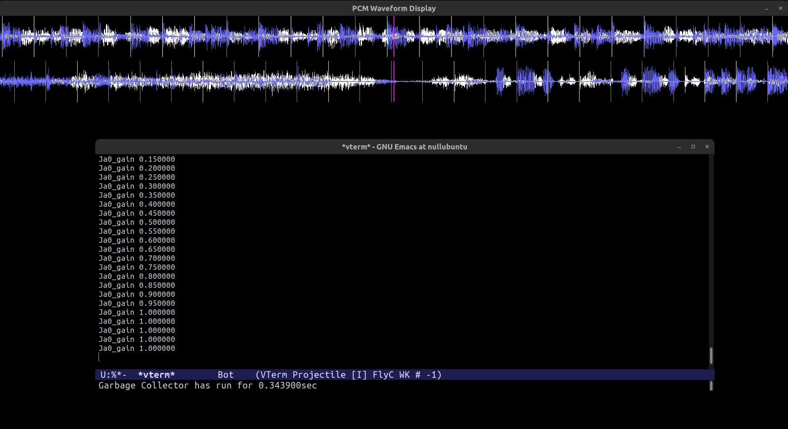

# finyl
finyl is a rekordbox USB compatible multi-stems DJ system for Linux 64 bits that lets you mix audio sources separately. (vocal, instrumental, etc)  
It is designed to run fast on Raspberry pi 3b+ RAM 1GB.




## build
make  
(c++20 compiler needed)  

Depends on...  
in debian: libasound2-dev (alsa), ffmpeg (cli), libsdl2-dev, libx11-dev, libssl-dev, java  

## usage
./finyl <path to rekordbox usb: example /media/null/22BC-F655/ >

read controller.cpp:handleKey() to guess how to control finyl from terminal;

### multi-stems mixing
A song usually consists of vocal, and instrument. The idea of multi-stems mixing is to let the software retain these two or more different sources(=stems) of audio separately, so that you can apply audio effects (volume control, echos, filters, etc) separately. To do that, you need to create stem files from the original file beforehand.

separate.cpp is a utility just for that. It generates stem files from the original files in rekordbox USB.
```
make separate
./separate # and follow the printed usage
```
It takes 30 seconds per track to separate on my machine that takes 7 seconds to `make` the project.

<details>
<summary>detail</summary>

When user loads a track, say `/rekodboxusb/Contents/UnknownArtist/UnknownAlbum/trackname.wav`, in multi-stems mode, finyl looks for matching stems files in `/rekordboxusb/finyl/separated/hdemucs_mmi/`.  
Here is the exact stem filepath format that finyl considers a match:  
`/<rekordboxusb>/finyl/separated/hdemucs_mmi/<anything>-<stem name>-<md5sum of the original file>.<any extension>`

`./separate` creates stem files that finyl considers a match.  
By default, the stem file extension is wav, because it is not compressed, thus fast to read. You can change this to anything ffmpeg can decode, by modifying the `separate.cpp`


In theory, you could use any other audio separation program, or other demucs model. To do that, you just need to replace all occurence of `demucs` or `hdemucs_mmi` to something else in the source. However, in my opinion now, demucs performs better and faster than other programs (tried UVR, spleeter), so not going to provide option for them.


</details>
